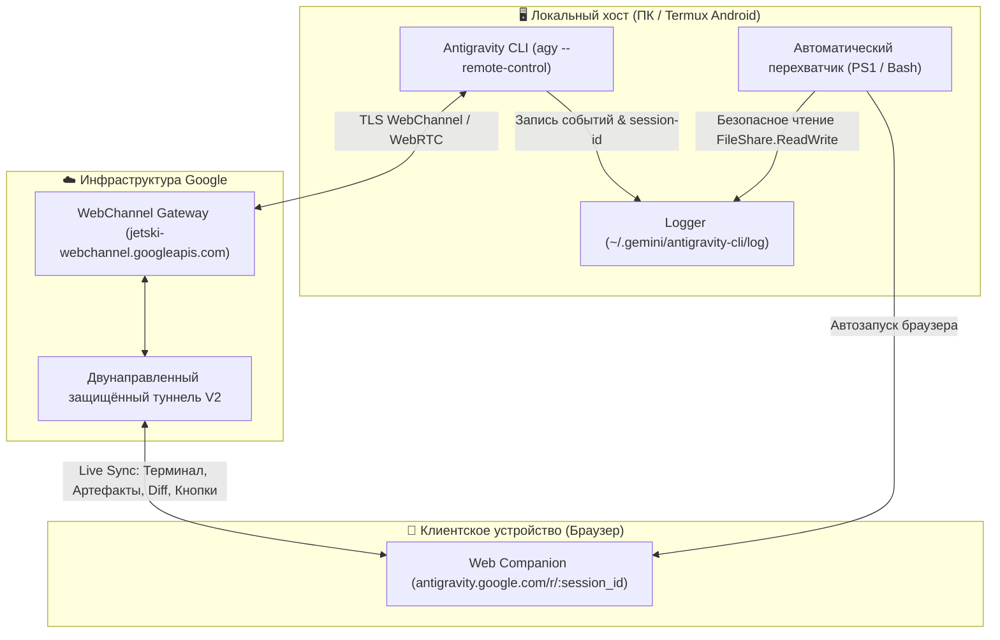

# 🛰️ Antigravity Remote Control (v1.2.6+)

Экспертный навык и набор автоматизированных инструментов для удалённого управления активными сессиями **Antigravity CLI** с любого устройства (ПК, смартфон, планшет) через официальный защищённый веб-интерфейс `antigravity.google.com`.

---

## 🏗️ 1. Архитектура Remote Control в Antigravity CLI v1.2.6+

Начиная с версии **1.2.6**, в Antigravity CLI реализована нативная подсистема удалённого подключения, позволяющая вести парное программирование и мониторить работу автономного агента удалённо.



### 🔹 Режимы работы: Session-scoped vs Cloud Hub

| Параметр | ⚡ Session-scoped (Основной режим) | 🌐 Cloud Hub (Background Daemon) |
| :--- | :--- | :--- |
| **Команда запуска** | `agy --remote-control` или `/remote-control` | `agy remote-control start [--session]` |
| **Жизненный цикл** | Привязан к текущему сеансу терминала | Фоновый системный сервис / сессионный демон |
| **Точка входа** | Уникальный URL: `https://antigravity.google.com/r/<session-id>` | Общий реестр машин в консоли аккаунта |
| **Автозавершение** | Закрытие окна CLI или команда `/remote-control off` | Явная остановка: `agy remote-control stop` |
| **Контекст безопасности** | Строго наследует активный permission-mode сессии | Запуск сессий с настройками по умолчанию |
| **Идеально для** | Быстрой работы со смартфона, виджетов Termux, рабочего стола | Постоянного удалённого сервера (VPS / GCP) |

---

## ⚡ 2. Ключевые возможности Live Sync

- **Сквозной стриминг токенов и мыслей (Thinking Frames):** Полное отображение внутренних рассуждений модели в реальном времени.
- **Интерактивное одобрение инструментов:** Подтверждение запуска консольных команд, редактирования файлов и MCP-инструментов в один клик с экрана смартфона с соблюдением настроенного режима (`accept-edits`, `proceed-in-sandbox`, `dangerously-skip-permissions`).
- **Синхронизированный Diff-инспектор:** Нативный просмотр изменений кода без искажения отступов.
- **Интерактивные карточки артефактов:** Удобный просмотр сгенерированных отчётов, архитектурных планов и скетчей прямо в мобильном браузере.
- **Двусторонняя отмена:** Нажатие кнопки «Stop / Cancel» в веб-интерфейсе мгновенно шлёт сигнал прерывания в терминал CLI.

---

## 💻 3. Инструкция для Windows

В состав навыка входят готовые скрипты автоматизации в директории `scripts/`.

### 🚀 Запуск в один клик

```powershell
# Запуск сессии в текущей директории с автоматическим открытием в браузере
powershell -ExecutionPolicy Bypass -File ".\scripts\start-remote-control.ps1"

# Запуск в определённой папке проекта
powershell -ExecutionPolicy Bypass -File ".\scripts\start-remote-control.ps1" -WorkDir "D:\Projects\MyApp"

# Запуск с дополнительными параметрами модели
powershell -ExecutionPolicy Bypass -File ".\scripts\start-remote-control.ps1" -AgyArgs "--model gemini-2.5-pro --effort high"
```

### 📌 Создание ярлыка на Рабочем столе

Скрипт автоматически найдет `agy.exe`, извлечёт оригинальную иконку и создаст ярлык `Remote Control AGY.lnk`:

```powershell
powershell -ExecutionPolicy Bypass -File ".\scripts\create-desktop-shortcut.ps1"
```

### 🔍 Как работает безопасное чтение журнала (FileShare.ReadWrite)

Так как процесс `agy.exe` держит активный файл журнала открытым на запись, стандартные методы чтения могут вызывать ошибку совместного доступа (`IOException / Sharing violation`). Скрипт `start-remote-control.ps1` применяет низкоуровневый файловый поток:

```powershell
$stream = [System.IO.FileStream]::new(
    $logPath,
    [System.IO.FileMode]::Open,
    [System.IO.FileAccess]::Read,
    [System.IO.FileShare]::ReadWrite
)
$reader = [System.IO.StreamReader]::new($stream, [System.Text.Encoding]::UTF8)
$content = $reader.ReadToEnd()
```

Скрипт отслеживает строки:
`[remote-control-7b909f69-f505-45c5-8ec8-b2d2bc12b3da-v2]`  
извлекает UUID сессии и формирует URL: `https://antigravity.google.com/r/<session-id>`.

---

## 📱 4. Инструкция для Termux (Android)

### 📦 Предварительные требования

В Termux должны быть установлены базовые утилиты:

```bash
pkg update
pkg install termux-api termux-tools jq grep
```

*(Убедитесь, что приложение **Termux:API** установлено из F-Droid или GitHub).*

### 🚀 Запуск из консоли

```bash
chmod +x scripts/start-remote-control.sh
./scripts/start-remote-control.sh
```

**Что происходит:**
1. Запускается фоновый наблюдатель журнала `$HOME/.gemini/antigravity-cli/log/cli-*.log`.
2. В текущем окне стартует интерактивный `agy --remote-control`.
3. При подключении туннеля скрипт автоматически:
   - Копирует сессионный URL в буфер обмена Android (`termux-clipboard-set`).
   - Отправляет Android Push-уведомление с кнопкой перехода (`termux-notification`).
   - Вызывает `termux-open-url`, открывая Chrome / Firefox прямо на смартфоне.

### 🔘 Настройка Termux:Widget (Запуск в 1 тап с домашнего экрана)

1. Выполните установку виджета:
   ```bash
   ./scripts/start-remote-control.sh --install-widget
   ```
   *(Команда создаст исполняемый ярлык в каталоге `~/.shortcuts/Antigravity-Remote.sh`)*.
2. Добавьте на рабочий стол смартфона виджет **Termux:Widget**.
3. Выберите в списке `Antigravity-Remote.sh`.
4. Теперь при нажатии на виджет мгновенно поднимается сессия и распахивается браузер с пультом управления!

---

## 🛠️ 5. Управление демоном Cloud Hub

Для постоянного присутствия машины в панели Remote Control:

```bash
# Регистрация и старт демона (до перезагрузки системы)
agy remote-control start --name "My-Desktop-PC"

# Старт демона только на время текущего входа пользователя
agy remote-control start --session --name "Office-Workstation"

# Проверка текущего статуса демона
agy remote-control status

# Остановка и дерегистрация демона
agy remote-control stop
```

---

## 🩺 6. Диагностика и Troubleshooting

- **Ошибка `You are not logged into Antigravity`:**
  Выполните в терминале авторизацию:
  ```bash
  agy login
  ```
- **Таймаут перехвата session-id:**
  Если веб-страница не открылась автоматически в течение 30 секунд:
  1. Посмотрите в терминал `agy` — убедитесь, что соединение установлено.
  2. Введите внутри сессии команду `/remote-control` для повторной инициализации.
  3. Проверьте фаервол/VPN: порт `443` к `jetski-webchannel.googleapis.com` должен быть доступен.
- **Строгая политика приватности:**
  Все скрипты навыка используют строго относительные пути и стандартные переменные окружения (`$env:USERPROFILE`, `$env:LOCALAPPDATA`, `$HOME`, `$PREFIX`). Никаких захардкоженных логинов или персональных путей.
